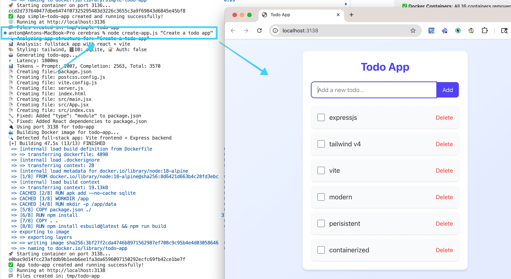

# Cerebras App Generator

A proof of concept demonstrating the power of [Cerebras AI](https://www.cerebras.ai/) for automated application generation. This tool uses the **Qwen3-480B Coder** model to generate complete applications with automatic Docker containerization and management.



## Installation

### Prerequisites

- **Node.js** (v16 or higher)
- **Docker** - Required for containerization and app deployment
- **Git** - For version control

### Quick Start

1. **Clone the repository:**
```bash
git clone https://github.com/restyler/poor-mans-lovable.git
cd poor-mans-lovable
```

2. **Install dependencies:**
```bash
npm install
```

3. **Set up environment:**
```bash
cp .env.example .env  # if .env.example exists
# Edit .env and add your CEREBRAS_API_KEY
```

## Setup

1. Create `.env` file with your Cerebras API key:
```bash
CEREBRAS_API_KEY=your_api_key_here
```

> **Note**: Get your API key from [Cerebras AI](https://www.cerebras.ai/)

## Usage

### Generate a New App
```bash
node create-app.js "Build a todo list REST API with Express.js"
```

### List Running Apps
```bash
node create-app.js --list
```

Shows all generated apps with:
- Running status and port
- App description and local path
- Volume information (ID and storage size) for running apps
- Creation timestamp

### Stop an App
```bash
node create-app.js --stop simple-todo-rest
```

### Remove an App
```bash
node create-app.js --remove simple-todo-rest
```

Completely removes:
- Docker container and image
- Associated Docker volumes and data
- Local files and directories
- App tracking from database

## Continuous Improvement

### Improve an Existing App
```bash
node create-app.js --improve "Add user authentication" --app todo-app
```

Continuously enhance apps with new features:
- 🔄 **Semantic Versioning**: Each improvement creates a new version (v1.0.0 → v1.1.0)
- 🐳 **Blue-Green Deployment**: Zero-downtime updates with automatic rollback
- 📝 **Change Tracking**: Monitors which files were modified, added, or removed
- 🔙 **Rollback Support**: Restore previous versions if improvements fail
- ⚡ **Optimized Builds**: 5-10x faster rebuilds using Docker layer caching

### Version Management
```bash
# View all versions of an app
node create-app.js --versions todo-app

# Rollback to a previous version
node create-app.js --rollback todo-app v1.0.0

# Compare versions
node create-app.js --diff todo-app v1.0.0 v1.1.0
```

### Improvement Examples
```bash
# Add new features
node create-app.js --improve "Add dark mode toggle" --app todo-app
node create-app.js --improve "Add user authentication" --app blog-app
node create-app.js --improve "Add real-time notifications" --app chat-app

# Enhance UI/UX
node create-app.js --improve "Make responsive for mobile" --app portfolio-site
node create-app.js --improve "Add search functionality" --app blog-app

# Backend improvements
node create-app.js --improve "Add API rate limiting" --app todo-api
node create-app.js --improve "Add data validation" --app user-service
```

## Features

- 🤖 **AI-Powered Generation**: Uses Cerebras AI to generate complete applications
- 🔄 **Continuous Improvement**: Iteratively enhance apps with version management and rollback
- 📁 **Organized Structure**: Each app gets its own folder in `./tmp/`
- 🐳 **Docker Integration**: Automatic containerization and port management
- ⚡ **Optimized Builds**: Multi-stage Docker builds with layer caching for 5-10x faster rebuilds
- 🔙 **Blue-Green Deployment**: Zero-downtime updates with automatic rollback on failure
- 📊 **Performance Tracking**: Displays API latency and token usage
- 🗂️ **App Management**: JSON-based storage to track all generated apps with full version history
- 🔒 **Safe Generation**: Generated files are isolated in tmp/ to protect your project
- 🎨 **Tailwind CSS v4 Support**: Proper PostCSS configuration and modern styling
- 🧠 **Intelligent Analysis**: LLM-powered app structure detection and optimization
- 📝 **Change Tracking**: File-level diff tracking and semantic versioning

## Generated App Structure

```
./tmp/
├── simple-todo-rest/     # Auto-generated descriptive folder name
│   ├── package.json
│   ├── server.js
│   ├── routes/
│   ├── controllers/
│   └── models/
├── nodejs-weather-api/   # Each app gets its own container
│   ├── Dockerfile        # Auto-generated Docker setup
│   └── ...
└── apps.json            # Tracks all generated apps
```

## Examples

```bash
# Generate a REST API
node create-app.js "Create a blog REST API with user authentication"

# Generate a web scraper
node create-app.js "Build a Node.js web scraper for news articles"

# Generate a real-time chat app
node create-app.js "Create a Socket.io chat application with rooms"

# Generate a modern frontend app with Tailwind CSS
node create-app.js "Create a todo app with Tailwind CSS styling"

# Generate a full-stack application
node create-app.js "Build a full-stack blog with React frontend and Express backend"
```

## API Response Format

The tool expects Cerebras to return files in this format:
```xml
<file path="filename.js">
// file content here
</file>
```

## Prompt Management

The tool uses modular prompts for different generation phases:

- **Analysis Prompts** (`prompts/analysis.js`): App structure detection and requirements analysis
- **Generation Prompts** (`prompts/generation.js`): Main application generation with Tailwind CSS v4 support
- **Enhancement Prompts** (`prompts/enhancement.js`): LLM customization based on app type

### Multi-Stage Generation Process

The app generation follows a sophisticated multi-stage approach to ensure optimal results:

#### **🔍 Stage 1: Analysis**
```javascript
const analysis = await this.analyzeAppStructure(prompt);
// Determines: appType, framework, buildTool, styling, database, etc.
```

**Purpose**: Intelligent detection of app requirements using LLM analysis
- **LLM-Powered**: Uses Cerebras AI to analyze the user's prompt
- **Smart Classification**: Determines if app is frontend, backend, or fullstack
- **Framework Detection**: Identifies React, Vue, Express, etc.
- **Fallback System**: Keyword-based detection if LLM analysis fails

#### **🎯 Stage 2: Enhancement**
```javascript
const enhancementPrompt = createEnhancementPrompt(prompt, analysis);
// Customizes generation based on analysis results
```

**Purpose**: Context-aware customization based on analysis results
- **App-Type Specific**: Different instructions for frontend, backend, fullstack
- **Dynamic Content**: Includes missing files, dependencies, recommendations
- **Contextual Adaptation**: Adapts prompt based on detected requirements

**Enhancement Examples**:
- **Frontend**: Focuses on UI components, styling, responsive design
- **Backend**: Emphasizes API routes, database integration, authentication
- **Fullstack**: Combines both frontend and backend requirements

#### **⚙️ Stage 3: Generation**
```javascript
const generationPrompt = generationPrompt(enhancementPrompt);
// Adds universal technical requirements and best practices
```

**Purpose**: Universal foundation with technical standards and best practices
- **Universal Requirements**: Core dependencies, file structures, configurations
- **Technical Standards**: Tailwind CSS v4 setup, SQLite usage, dependency management
- **Best Practices**: Build tools, PostCSS configs, Docker considerations

#### **🔧 Stage 4: Post-Generation Fixes**
```javascript
await this.applyPostGenerationFixes(appPath, analysis);
// Ensures proper configuration and dependencies
```

**Purpose**: Automatic fixes and validation after generation
- **Dependency Validation**: Ensures all required packages are included
- **Configuration Fixes**: Creates missing config files (postcss.config.js, etc.)
- **Syntax Updates**: Updates CSS files to use correct Tailwind v4 syntax

### Prompt Architecture Benefits

#### **🎯 Separation of Concerns**
- **Analysis**: "What type of app do we need?" (Context)
- **Enhancement**: "What specific features does this app type need?" (Customization)
- **Generation**: "How do we build it properly?" (Standards)
- **Fixes**: "What common issues need to be resolved?" (Validation)

#### **🔄 Flexibility & Maintainability**
- **Easy Updates**: Modify universal standards in generation prompt
- **App-Type Logic**: Customize behavior in enhancement prompt
- **Reusability**: Generation prompt works for any app type
- **Extensibility**: Add new app types to enhancement prompt

#### **📊 Example Workflow**
```
User Input: "Create a todo app with Tailwind CSS"

Stage 1 (Analysis):
  → Detects: frontend, react, vite, tailwind, no database

Stage 2 (Enhancement):
  → Adds: "Modern frontend with react and vite"
  → Adds: "CRITICAL: Always create src/index.css with @import 'tailwindcss'"

Stage 3 (Generation):
  → Adds: "If using Tailwind CSS v4, include @tailwindcss/postcss"
  → Adds: "Create postcss.config.js with proper configuration"

Stage 4 (Fixes):
  → Creates: postcss.config.js if missing
  → Updates: CSS files to use @import syntax
  → Validates: All dependencies are present
```

### Tailwind CSS v4 Support

All generated apps with Tailwind CSS now include:
- Proper `@tailwindcss/postcss` dependency
- Automatic `postcss.config.js` creation
- Correct `@import "tailwindcss"` syntax in CSS files
- Post-generation fixes to ensure proper configuration

## Management

All apps are tracked in `apps.json` with:
- App name and description
- Generated folder path
- Docker container info
- Port assignments (starting from 3100)
- Creation timestamp
- Performance metrics (latency, tokens)

## Recent Improvements

### Tailwind CSS v4 Configuration Fix

**Problem**: Generated apps with Tailwind CSS v4 were missing proper PostCSS configuration, resulting in unstyled interfaces.

**Solution**: 
- Added `@tailwindcss/postcss` dependency requirement
- Automatic `postcss.config.js` creation with proper configuration
- Updated CSS files to use `@import "tailwindcss"` syntax
- Post-generation fixes to ensure proper setup

**Result**: All future apps with Tailwind CSS v4 now display properly styled interfaces.

### Intelligent App Analysis

- **LLM-Powered Detection**: Uses Cerebras AI to analyze app requirements and determine optimal structure
- **Hybrid Generation**: Combines Vite scaffolding with LLM enhancement for better results
- **Smart Fallbacks**: Keyword-based detection when LLM analysis fails
- **App Type Detection**: Automatically identifies frontend, backend, or fullstack requirements

### Hybrid Generation Strategy

For frontend apps with Vite, the tool uses a sophisticated hybrid approach:

1. **Vite Scaffolding**: Creates base project structure using `npm create vite@latest`
2. **LLM Enhancement**: Customizes the scaffolded project with specific requirements
3. **Fallback System**: Falls back to pure LLM generation if scaffolding fails

This approach combines the reliability of Vite's scaffolding with the flexibility of LLM customization.

## Performance

### Benchmark Results

We generated 10 different applications to benchmark Cerebras API performance:

| App Type | Complexity | Latency | Tokens | Files | Speed (tok/s) |
|----------|------------|---------|--------|-------|---------------|
| Todo REST API | Simple | 2.7s | 1,757 | 5 | 650 |
| Weather API | Medium | 1.2s | 1,390 | 7 | 1,116 |
| File Upload API | Simple | 1.8s | 2,200 | 6 | 1,248 |
| URL Shortener | Complex | 2.8s | 3,627 | 8 | 1,283 |
| GraphQL API | Complex | 1.9s | 3,109 | 6 | 1,646 |
| HTML Landing | Frontend | 1.8s | 2,815 | 3 | 1,587 |
| Blog API | Complex | 2.5s | 4,950 | 4 | 1,946 |
| Full-Stack Blog | Full-Stack | 3.1s | 6,167 | 8 | 1,984 |

### Key Findings

**🚀 Consistent Speed**: 1.2-3.1 second latency across all app types  
**📈 High Throughput**: 650-1,984 tokens/second generation speed  
**🎯 Quality Output**: All apps generated with proper file structure and working code  
**📁 Multi-file Support**: Successfully creates 3-8 files per application  
**🧠 Complex Logic**: Handles GraphQL schemas, SQLite databases, authentication, full-stack applications  

### Performance Characteristics

- **Simple APIs**: ~1.5s average, ~1000 tok/s
- **Complex Apps**: ~2.5s average, ~1400 tok/s  
- **Full-Stack Apps**: ~3.0s average, ~1900 tok/s
- **Frontend Apps**: ~1.8s average, ~1400 tok/s

Each generation shows:
```
⚡ Latency: 1889ms
📊 Tokens - Prompt: 51, Completion: 3058, Total: 3109
```

## Database Integration

**🗄️ SQLite Support**: All generated apps use SQLite for database needs instead of external dependencies like Redis or MongoDB. This ensures:

- **Zero External Dependencies**: No need to run separate database containers
- **Persistent Storage**: Database files are stored in Docker volumes
- **Production Ready**: Full SQL support with foreign keys and relationships
- **Easy Development**: Works out of the box without configuration

### Database Features

- User authentication with bcrypt password hashing
- Blog posts with author relationships
- Comments system with foreign keys
- Automatic schema creation on startup
- Data persistence across container restarts

## Docker Integration

- Auto-builds Docker images for each app
- Includes SQLite support in all containers
- Manages port allocation (3100, 3101, 3102...)
- Names containers by app name for easy management
- Creates persistent volumes for database storage
- Handles container start/stop/remove operations
- Supports different app types (frontend-only, backend-only, fullstack)
- Automatic template selection based on app structure

### ⚠️ Security Note

This proof of concept uses plain Docker containers for simplicity. For real-world deployments, more robust sandboxing technologies should be considered:

- **[Firecracker](https://firecracker-microvm.github.io/)** - AWS Lambda's microVM technology
- **[gVisor](https://gvisor.dev/)** - Google's container runtime with enhanced security
- **[Kata Containers](https://katacontainers.io/)** - Lightweight VMs for containers

See [awesome-sandbox](https://github.com/restyler/awesome-sandbox) for a comprehensive list of sandboxing engines and security technologies.